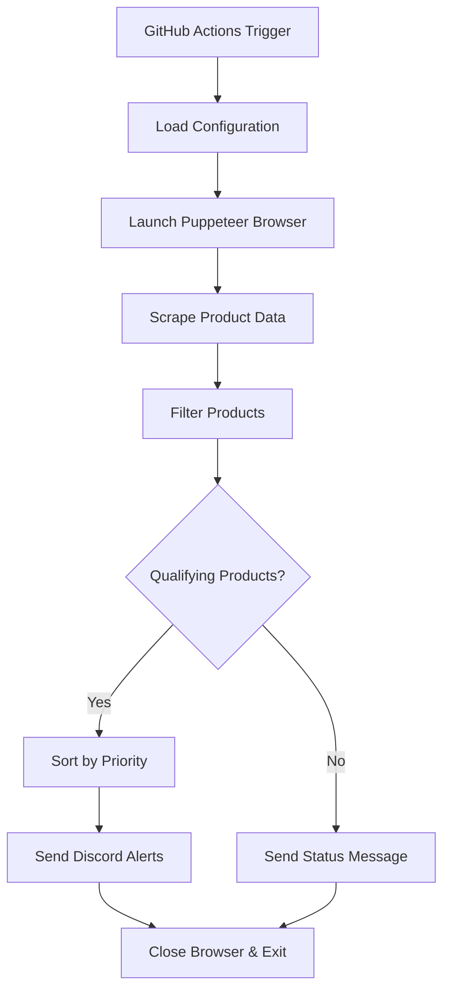

# Price Checker Bot

Automated price monitoring system that tracks sales on Holt Renfrew and sends Discord notifications for qualifying items. Built to run on GitHub Actions for free, automated monitoring.

## Features

- 🛍️ **Smart Product Filtering**: Focuses on handbags and designer items with significant discounts
- 🤖 **Discord Notifications**: Rich embed messages with product details, images, and direct links
- ⚙️ **Configurable Monitoring**: Easily adjust target website, categories, brands, and discount thresholds
- 🔄 **Automated Scheduling**: Runs hourly via GitHub Actions (completely free)
- 📊 **Detailed Logging**: Comprehensive logs for monitoring and debugging

## Quick Setup

### 1. Create Discord Bot

1. Go to [Discord Developer Portal](https://discord.com/developers/applications)
2. Click "New Application" and give it a name
3. Go to "Bot" section and click "Add Bot"
4. Copy the bot token (you'll need this later)
5. Under "Privileged Gateway Intents", enable "Message Content Intent"

### 2. Add Bot to Your Server

1. In Discord Developer Portal, go to "OAuth2" > "URL Generator"
2. Select scopes: `bot`
3. Select bot permissions: `Send Messages`, `Use Slash Commands`, `Embed Links`
4. Copy the generated URL and open it to add the bot to your server
5. Create a channel called `price-alerts` (or modify the channel name in config.json)

### 3. Deploy to GitHub

1. Fork this repository or create a new one with these files
2. Go to your repository Settings > Secrets and variables > Actions
3. Add a new repository secret:
   - Name: `DISCORD_BOT_TOKEN`
   - Value: Your Discord bot token from step 1

### 4. Configure Monitoring (Optional)

Edit `config.json` to customize:

```json
{
	"website": {
		"url": "https://www.holtrenfrew.com/en/Products/Womens/Collections/Sale/c/WomensSale",
		"name": "Holt Renfrew Sale"
	},
	"monitoring": {
		"frequency": "0 * * * *",
		"minDiscountPercent": 50,
		"categories": ["handbag", "bag", "purse", "clutch", "tote"],
		"designerBrands": ["Gucci", "Louis Vuitton", "Chanel", "Prada", ...]
	},
	"discord": {
		"enabled": true,
		"channelName": "price-alerts"
	}
}
```

### 5. Test the Setup

1. Go to Actions tab in your GitHub repository
2. Click on "Price Checker Bot" workflow
3. Click "Run workflow" to test manually
4. Check your Discord channel for notifications

## How It Works



## Configuration Options

### Website Settings
- `url`: Target website URL to monitor
- `name`: Display name for the website

### Monitoring Criteria
- `frequency`: Cron expression for GitHub Actions schedule
- `minDiscountPercent`: Minimum discount percentage to qualify
- `categories`: Product categories to monitor (handbags, etc.)
- `designerBrands`: List of designer brands to prioritize

### Discord Settings
- `enabled`: Enable/disable Discord notifications
- `channelName`: Discord channel name for alerts

## Local Development

1. Clone the repository
2. Install dependencies: `npm install`
3. Copy `.env.example` to `.env` and add your Discord bot token
4. Run locally: `npm start`

## Customizing for Other Websites

To monitor different websites:

1. Update the `url` in `config.json`
2. Modify the CSS selectors in `src/scraper.js` to match the new website's structure
3. Adjust filtering criteria in `config.json` as needed

## Troubleshooting

### Bot Not Responding
- Check that the Discord bot token is correctly set in GitHub Secrets
- Verify the bot has proper permissions in your Discord server
- Ensure the channel name matches your configuration

### No Products Found
- The website might have changed its structure
- Check GitHub Actions logs for specific error messages
- CSS selectors in `scraper.js` may need updating

### GitHub Actions Not Running
- Verify the workflow file is in `.github/workflows/`
- Check that GitHub Actions are enabled for your repository
- Cron schedules may take up to an hour to start running

## Contributing

1. Fork the repository
2. Create a feature branch
3. Make your changes
4. Test locally
5. Submit a pull request

## License

MIT License - feel free to modify and distribute as needed.
