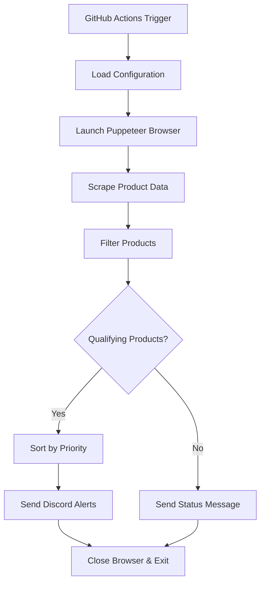

# Price Checker Bot

Automated price monitoring system that tracks sales on Holt Renfrew and sends Discord notifications for qualifying items, plus a stock watcher for hard-to-get products at Canadian retailers. Built to run on GitHub Actions for free, automated monitoring.

## Features

- 🛍️ **Smart Product Filtering**: Focuses on handbags and designer items with significant discounts
- 🤖 **Discord Notifications**: Rich embed messages with product details, images, and direct links
- ⚙️ **Configurable Monitoring**: Easily adjust target website, categories, brands, and discount thresholds
- 🔄 **Automated Scheduling**: Runs hourly via GitHub Actions (completely free)
- 📊 **Detailed Logging**: Comprehensive logs for monitoring and debugging

## Quick Setup

### 1. Create Discord Bot

1. Go to [Discord Developer Portal](https://discord.com/developers/applications)
2. Click "New Application" and give it a name
3. Go to "Bot" section and click "Add Bot"
4. Copy the bot token (you'll need this later)
5. Under "Privileged Gateway Intents", enable "Message Content Intent"

### 2. Add Bot to Your Server

1. In Discord Developer Portal, go to "OAuth2" > "URL Generator"
2. Select scopes: `bot`
3. Select bot permissions: `Send Messages`, `Use Slash Commands`, `Embed Links`
4. Copy the generated URL and open it to add the bot to your server
5. Create a channel called `price-alerts` (or modify the channel name in config.json)

### 3. Deploy to GitHub

1. Fork this repository or create a new one with these files
2. Go to your repository Settings > Secrets and variables > Actions
3. Add a new repository secret:
   - Name: `DISCORD_BOT_TOKEN`
   - Value: Your Discord bot token from step 1

### 4. Configure Monitoring (Optional)

Edit `config.json` to customize:

```json
{
	"website": {
		"name": "Holt Renfrew Sale",
		"baseUrl": "https://www.holtrenfrew.com",
		"landingPath": "/en/Products/Womens/Collections/Sale/c/WomensSale",
		"saleCategory": "WomensSale",
		"sort": "date-desc",
		"categories": [
			{ "name": "Shoes", "facet": "womensshoes" },
			{ "name": "Jewellery & Watches", "facet": "jewellerywatches" }
		]
	},
	"monitoring": {
		"minDiscountPercent": 70,
		"categories": ["bag", "shoe", "ring", "..."],
		"designerBrands": ["Gucci", "Chloe", "..."]
	},
	"discord": {
		"enabled": true,
		"alertChannelName": "price-alerts",
		"summaryChannelName": "hourly-summaries"
	}
}
```

### 5. Test the Setup

1. Go to Actions tab in your GitHub repository
2. Click on "Price Checker Bot" workflow
3. Click "Run workflow" to test manually
4. Check your Discord channel for notifications

## How It Works



## Configuration Options

### Website Settings
- `name`: Display name used in Discord alerts
- `baseUrl` / `landingPath`: The sale page the headless browser opens first (sets the site's cookies)
- `saleCategory`: Sale category code used by the `/en/c/{saleCategory}/results` JSON API
- `sort`: API sort code (`date-desc` keeps paging stable)
- `categories`: Sale sections to scrape; `facet` is the site's `storefrontFacetCategories` code (see the facet list in any `/results` response)

### Monitoring Criteria
- `minDiscountPercent`: Discount needed for an `@here` alert; lower discounts go to the hourly summary
- `categories`: Whole-word keywords (plurals allowed) matched against name, category and URL
- `designerBrands`: Designer brands (accent-insensitive, whole words); a match qualifies any product

### Discord Settings
- `enabled`: Enable/disable Discord notifications
- `alertChannelName`: Channel for 70%+ alerts
- `summaryChannelName`: Channel for hourly summaries (only posted when there is something new) and warnings

### Behaviour
- Colour variants of the same style are merged into one alert that lists the colours
- Alerts and summary items are remembered in `state/notified.json`, so each deal is posted once (again only if its price drops)
- If a category comes back incomplete, the summary lists which one and how many products were missed

## Local Development

1. Clone the repository
2. Install dependencies: `npm install`
3. Copy `.env.example` to `.env` and add your Discord bot token
4. Run locally: `npm start`

## Customizing for Other Websites

To monitor different websites:

1. Find the site's product-listing JSON request in the browser's network tab
2. Adapt `src/scraper.js` (request URL and paging) and `src/apiParser.js` (field mapping) to it
3. Adjust filtering criteria in `config.json` as needed

## Stock Watcher

A second workflow (`.github/workflows/stock-watcher.yml`) checks Canadian retailers every 10 minutes for products listed under `stockWatch` in `config.json`, and posts to `#stock-alerts`:

- `@here` alert when a listing goes from not-in-stock to in stock (only when the retailer itself is the seller)
- Quiet notes when it sells out again, first appears in a store, or only shows from a marketplace reseller
- If a retailer blocks the bot, that retailer backs off (10, 20, 40... up to 120 minutes) and a quiet warning is posted after 3 failures in a row. CAPTCHAs and bot checks are never bypassed.
- It only alerts. It never adds to cart or buys.

Supported `retailer` ids: `nintendo-ca` (needs `sku`), `bestbuy-ca` (needs `sku`), `walmart-ca`, `ebgames` (best effort: EB Games usually blocks automated browsers).

Setup: create a `#stock-alerts` channel the bot can post in. State is kept in the GitHub Actions cache (`state/stock.json`, not committed).

Run once locally without Discord or state: `npm run stock -- --dry-run`

## Testing

- `npm test`: offline checks (no network)
- `npm test -- --test-scraping`: also runs a live scrape and reports per-category coverage
- `npm test -- --test-discord`: also checks the bot can log in and see both channels

## Troubleshooting

### Bot Not Responding
- Check that the Discord bot token is correctly set in GitHub Secrets
- Verify the bot has proper permissions in your Discord server
- Ensure the channel name matches your configuration

### No Products Found
- The website might have changed its API or category codes
- Check GitHub Actions logs for specific error messages
- Run `npm test -- --test-scraping` and compare each category's collected/expected counts

### GitHub Actions Not Running
- Verify the workflow file is in `.github/workflows/`
- Check that GitHub Actions are enabled for your repository
- Cron schedules may take up to an hour to start running

## Contributing

1. Fork the repository
2. Create a feature branch
3. Make your changes
4. Test locally
5. Submit a pull request

## License

MIT License - feel free to modify and distribute as needed.
